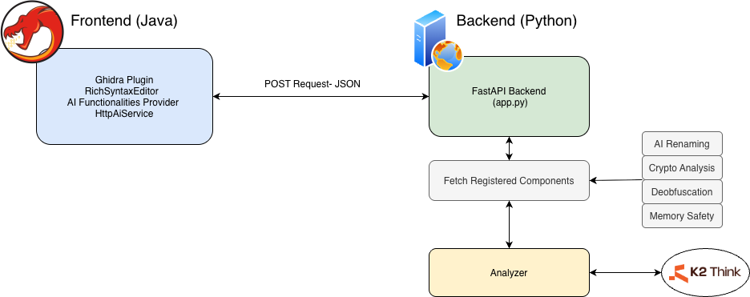
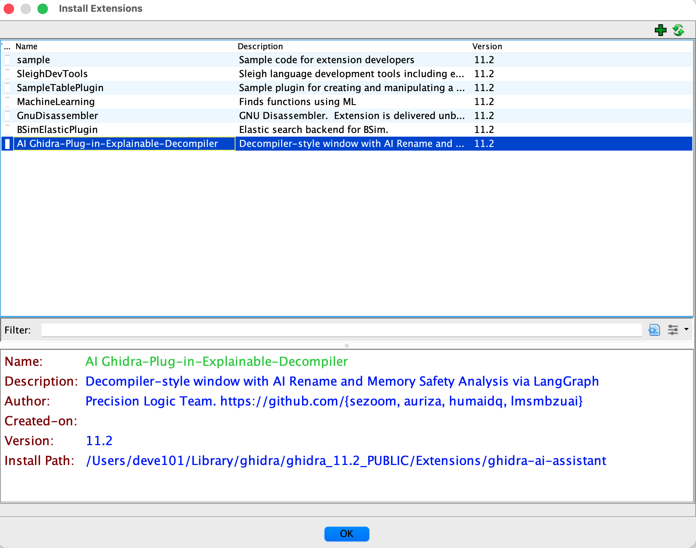

# Ghidra-Plugin Explainable-Decompiler


AI Explainable-Decompiler is a modular Ghidra plugin and backend system for AI-assisted reverse engineering using K2-Think reasoning model. It supports multiple analysis components such as rename suggestions, memory safety analysis, crypto analysis, and deobfuscation through a scalable frontend and backend architecture.

---

## Overview

### Feature Summary

| Component | Purpose | Output Type |
|---|-----|---|
| Rename | Suggest better function and variable names |  Structured rename result       |
| Memory Safety | Detect classic memory safety issues  | Issue list + overall assessment |
| Crypto Analysis | Detect cryptographic weaknesses  | Issue list + overall assessment |
| Deobfuscation | Simplify and deobfuscate code  | Clean code + notes |


[Watch the demo video](./images/clib1.mp4)
---

## Architecture
The project is split into two main parts:

- **Frontend (Ghidra plugin, Java)**  
  Provides the UI inside Ghidra, extracts decompiled code and metadata, sends requests to the backend, and renders results.

- **Backend (Python / FastAPI)**  
  Receives analysis requests, dispatches them to the correct component, interacts with the LLM, validates structured output, and returns results to the frontend.



### Frontend structure

```text
ai.explainable
├─ plugin
│  ├─ AIExplainablePlugin.java
│  ├─ AnalysisProvider.java
│  ├─ AnalysisContext.java
│  ├─ AnalysisView.java
│  └─ ComponentRegistry.java
├─ backend
│  ├─ BackendClient.java
│  └─ HttpBackendClient.java
├─ components
│  ├─ AnalysisComponent.java
│  ├─ rename
│  │  ├─ RenameComponent.java
│  │  ├─ RenameRequest.java
│  │  ├─ RenameResult.java
│  │  ├─ RenameItem.java
│  │  ├─ VariableCandidate.java
│  │  └─ RenamePreviewBuilder.java
│  ├─ memory
│  │  ├─ MemorySafetyComponent.java
│  │  ├─ MemorySafetyRequest.java
│  │  ├─ MemorySafetyResult.java
│  │  └─ MemorySafetyIssue.java
│  ├─ deobfuscation
│  │  ├─ DeobfuscationComponent.java
│  │  ├─ DeobfuscationRequest.java
│  │  └─ DeobfuscationResult.java
│  └─ crypto
│     ├─ CryptoAnalysisComponent.java
│     ├─ CryptoAnalysisRequest.java
│     ├─ CryptoAnalysisIssue.java
│     └─ CryptoAnalysisResult.java
└─ decompiler
   └─ DecompileHelper.java
```

### Backend structure

```text
backend/
├─ app.py
├─ schemas.py
├─ llm.py
├─ analyzer.py
├─ components/
│  ├─ __init__.py
│  ├─ rename/
│  │  ├─ component.py
│  │  ├─ prompt.py
│  │  └─ schema.py
│  ├─ memory_safety/
│  │  ├─ component.py
│  │  ├─ prompt.py
│  │  └─ schema.py
│  ├─ crypto/
│  │  ├─ component.py
│  │  ├─ prompt.py
│  │  └─ schema.py
│  └─ deobfuscation/
│     ├─ component.py
│     ├─ prompt.py
│     └─ schema.py
```

---


## Frontend Flow

1. User loads a function in Ghidra.
2. The plugin decompiles the function.
3. The selected analysis component builds a request.
4. The frontend sends the request to the backend using:

```http
POST /analyze/{component_id}
```

5. The backend dispatches the request to the matching component.
6. The backend returns structured JSON.
7. The frontend renders the result in the plugin UI.

---

## Backend API

### Unified endpoint

```http
POST /analyze/{component_id}
Content-Type: application/json
```

Supported `component_id` values:

- `rename`
- `memory_safety`
- `crypto`
- `deobfuscation`

---

## Backend Request Structures

### Rename request

```json
{
  "decompiled_code": "string",
  "function_name": "string",
  "variables": [
    {
      "target_id": "string",
      "kind": "string",
      "current_name": "string",
      "data_type": "string",
      "storage": "string",
      "first_use": "string",
      "source_type": "string",
      "is_auto_name": true,
      "token_count": 0
    }
  ]
}
```

### Memory safety request

```json
{
  "decompiled_code": "string",
  "function_name": "string"
}
```

### Crypto analysis request

```json
{
  "decompiled_code": "string",
  "function_name": "string"
}
```

### Deobfuscation request

```json
{
  "decompiled_code": "string",
  "function_name": "string"
}
```

---

## Backend Response Structures

### Rename response

```json
{
  "function_rename": {
    "target_id": "function",
    "kind": "function",
    "old_name": "old_name",
    "new_name": "new_name",
    "explanation": "reason for rename"
  },
  "variable_renames": [
    {
      "target_id": "string",
      "kind": "string",
      "old_name": "string",
      "new_name": "string",
      "explanation": "string"
    }
  ],
  "summary": "string"
}
```

### Memory safety response

```json
{
  "issues": [
    {
      "issue_type": "string",
      "description": "string",
      "location": "string",
      "severity": "critical | high | medium | low",
      "suggestion": "string"
    }
  ],
  "overall_assessment": "string"
}
```

### Crypto analysis response

```json
{
  "issues": [
    {
      "issue_type": "string",
      "description": "string",
      "location": "string",
      "severity": "critical | high | medium | low",
      "suggestion": "string"
    }
  ],
  "overall_assessment": "string"
}
```

### Deobfuscation response

```json
{
  "clean_code": "string",
  "changes_summary": "string",
  "notes": "string"
}
```

---

## Example API Calls

### Rename

```http
POST /analyze/rename
Content-Type: application/json
```

```json
{
  "decompiled_code": "int FUN_140001000(...) { ... }",
  "function_name": "FUN_140001000",
  "variables": [
    {
      "target_id": "local:rbp-0x10@140001020",
      "kind": "local",
      "current_name": "local_10",
      "data_type": "int",
      "storage": "Stack[-0x10]:4",
      "first_use": "140001020",
      "source_type": "DEFAULT",
      "is_auto_name": true,
      "token_count": 3
    }
  ]
}
```

### Memory safety

```http
POST /analyze/memory_safety
Content-Type: application/json
```

```json
{
  "decompiled_code": "char buf[16]; gets(buf);",
  "function_name": "main"
}
```

### Crypto

```http
POST /analyze/crypto
Content-Type: application/json
```

```json
{
  "decompiled_code": "custom crypto logic here",
  "function_name": "FUN_140009000"
}
```

### Deobfuscation

```http
POST /analyze/deobfuscation
Content-Type: application/json
```

```json
{
  "decompiled_code": "obfuscated decompiled code here",
  "function_name": "FUN_140001234"
}
```

---

## How to Install the Plugin

### 1. Build the frontend extension

From the frontend project directory:

```bash
gradle clean buildExtension -PGHIDRA_INSTALL_DIR="/path/to/ghidra"
```

This produces a Ghidra extension zip.

### 2. Install in Ghidra

Open Ghidra and go to:

```text
File -> Install Extensions
```

Then:
- click the add/install option
- select the built extension zip
- restart Ghidra



### 3. Verify the plugin is available

After restart, open the plugin from the Ghidra UI and confirm:
- the analysis panel appears
- the component selector is visible
- backend requests can be sent

---

## How to Run the Backend

From the backend directory:

```bash
python -m venv .venv
source .venv/bin/activate
pip install -r requirements.txt
uvicorn app:app --reload
```

By default, the frontend expects the backend at:

```text
http://127.0.0.1:8000
```

---

## Dependencies

### Frontend
- Java
- Gradle
- Ghidra
- Gson
- RSyntaxTextArea

Example dependency for syntax highlighting:

```gradle
implementation 'com.fifesoft:rsyntaxtextarea:3.3.4'
```

### Backend
- Python 3.10+
- FastAPI
- Uvicorn
- Pydantic
- python-dotenv
- LangChain / model integration libraries as configured

---

## Extending the System

To add a new analysis component:

### Frontend
1. Create a new component under `components/<name>/`
2. Implement `AnalysisComponent`
3. Add request/result classes
4. Register it in `ComponentRegistry`

### Backend
1. Create `components/<name>/component.py`
2. Add `prompt.py`
3. Add `schema.py`
4. Register the component in `components/__init__.py`

If both sides use the same `component_id`, the unified API path works automatically:

```http
POST /analyze/<component_id>
```

---
# Control Layer + Self-Correction Loop

## Step 1: Decompiled Code Snapshot
Within Ghidra, once the plugin is open, selecting `Load Current Decompilation` automatically creates a snapshot of the currently decompiled code. This snapshot is stored in JSON format and includes key elements such as the function name, local variables, and call references. The structure is as follows:

```json
{
  "function_name": "",
  "address": "",
  "signature": "",
  "return_type": "",
  "parameters": [],
  "local_variables": [
    {
      "name": "",
      "type": "",
      "storage": "",
      "size": 0
    }
  ],
  "calls": [
    {
      "callee": "",
      "address": ""
    }
  ],
  "decompiled_code": ""
}
````

The output directory path for this file can be configured in [`extension.properties`](ghidra-ai-assistant/extension.properties).

## Step 2: Control Layer Inner Workings

The control layer validates whether the functions, variables, and calls referenced in the LLM output are present in the original decompiled code.

Each component follows a consistent workflow: the JSON snapshot is loaded, a component-specific processing step is applied, and a corresponding report is generated within the Ghidra interface.

Example output:

```txt
[ Control Layer ]

Verifies that functions and variables mentioned by the LLM exist in the original decompiled code.

Verdict: ⚠ PARTIAL — some claims unverified
  ✔ Functions          tested: 1, false: 0
  ✘ Local variables    tested: 4, false: 1
  ✔ Calls              tested: 0, false: 0

Total tested: 5  |  False rate: 20.0%

✘ Unverified claims:
  Functions:       —
  Local variables: PTR____stack_chk_guard_100004010
  Calls:           —
```

## Step 3: Self-Correction Loop

When the Control Layer detects unverified claims in the LLM output (i.e. functions, local variables, or calls that do not exist in the original decompiled code), the system automatically triggers a self-correction loop. The unverified claims are injected back into the prompt as explicit feedback, and the LLM is asked to revise its answer using only names present in the source. This process repeats up to 3 times until the false rate reaches 0% or the attempt limit is reached. The final Control Layer report indicates whether a correction was needed with a `↻ Self-corrected in N attempts` line in the Ghidra UI.

Example output:

```txt
[ Control Layer ]

...

Total tested: 5  |  False rate: 0.0%

  ↻ Self-corrected in 2 attempts

──────────────────────────────────────────────────────────

```

## Adding the Control Layer to a New Component

> **Reference implementation:** see `components/memory_safety/` (backend) and `ai.explainable.components.memory.MemorySafetyComponent` / `MemorySafetyResult` (frontend) as the canonical example to follow.

### Backend

**1. `components/<name>/control.py`** — create this file. Implement a `verify(llm_result: dict, source_json_path: str) -> str` function that extracts the relevant fields from the LLM result into three lists (`functions`, `local_variables`, `calls`), then calls `run_verification()` and `format_report()` from `control_base.py` and returns the formatted string. See `components/memory_safety/control.py` for a complete example.

**2. `components/<name>/component.py`** — import your `control` module and add `run_control()`:
```python
from components.<name> import control

def run_control(self, result: dict, source_json_path: str) -> str:
    return control.verify(result, source_json_path)
```
No other backend files need to be modified. `analyzer.py` automatically calls `run_control()` and injects the result as `control_output` in the response if `source_json_path` is set.

### Frontend

**1. `<Name>Result.java`** — add the `control_output` field so Gson can deserialize it. See `MemorySafetyResult.java` for reference:
```java
@SerializedName("control_output")
private String controlOutput;

public String getControlOutput() { return controlOutput; }
```

**2. `<Name>Component.java`** — append the control output at the end of your `format()` method, just before returning the string. See `MemorySafetyComponent.java` for reference:
```java
if (result.getControlOutput() != null && !result.getControlOutput().isBlank()) {
    sb.append("\n").append(result.getControlOutput()).append("\n");
}
```

Gson silently ignores `control_output` if the backend does not send it, so components without a `control.py` are unaffected.
